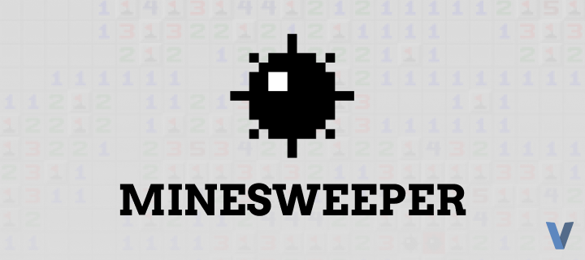

  
  <h1 >Minesweeper V</h1>
  
<strong>Simple Minesweeper written in <a href="https://vlang.io">vlang</a></storng>

## Installation

You can download it from the [release page](./releases) or run it on your pc with `v -autofree run .`

## Controllers

|Control        |Description        |
|---------------|-------------------|
|Q-key          |Change click mode  |
|R-key          |Restart the game   |
|Mouse Button 1 |Click the cell     |

## License
This repository [MIT Licensed](./LICENSE)
