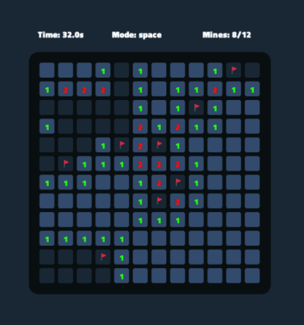

  
  <h3>Minesweeper V</h3>
  
Simple Minesweeper game written in <a href="https://vlang.io">vlang</a>

  
  

## 📩 Installation

- Make sure to have [V compiler](https://vlang.io/) installed in your machine.
- You can compile and run the game using `v run .`

## ⚽ Controls

|Control        |Description              |
|---------------|-------------------------|
|Q-key          |Change right-click mode  |
|R-key          |Restart the game         |
|Mouse Button 1 |Click the cell           |
|Mouse Button 2 |Mark mine                |

## 📷 Screenshots

## 📄 License
This repository is licensed under the [MIT License](./LICENSE)
